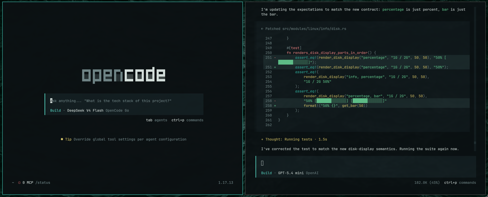

<div align="center">

# Leenium OpenCode


**A dark OpenCode theme built from the shared Leenium palette.**

Hosted under `github.com/drunkleen/leenium.opencode`.



</div>

---

## Features

- **Shared palette** - matches the same Leenium color language used across the repo
- **TUI-ready** - built for OpenCode's terminal interface
- **High contrast** - readable foregrounds and restrained borders
- **Semantic coverage** - background, panel, selection, diff, markdown, and syntax roles are mapped
- **Lightweight setup** - a single JSON theme file

---

## Install

```bash
mkdir -p ~/.config/opencode/themes
cp ./leenium.json ~/.config/opencode/themes/leenium.json
```

---

## Use

Set the theme in `~/.config/opencode/tui.json`:

```json
{
  "$schema": "https://opencode.ai/tui.json",
  "theme": "leenium"
}
```

Or switch it from inside OpenCode with `/theme`.

---

## The Leenium Ecosystem

Leenium is a unified dark desktop environment built around the same color palette. Alongside this Waybar theme, the project ships matching configs for:

- [**Firefox**](github.com/drunkleen/leenium.firefox) - browser theme extension
- [**Ghidra**](github.com/drunkleen/leenium.ghidra) - reverse engineering framework theme
- [**Hyprlock**](github.com/drunkleen/leenium.hyprlock) - hyprland lockscreen
- [**Limine**](github.com/drunkleen/leenium.limine) - BootLoader
- [**Neovim**](github.com/drunkleen/leenium.nvim) - syntax highlights and UI elements
- [**Omarchy**](github.com/drunkleen/leenium.omarchy) - desktop theme bundle
- [**VS Code**](github.com/drunkleen/leenium.vscode) - editor theme and UI palette
- [**Waybar**](github.com/drunkleen/leenium.waybar) - editor theme and UI palette

Visit [github.com/drunkleen](https://github.com/drunkleen) or [leenium.drunkleen.com](https://leenium.drunkleen.com/) to explore the full setup.

---

## License

MIT © [Leenium](LICENSE)
